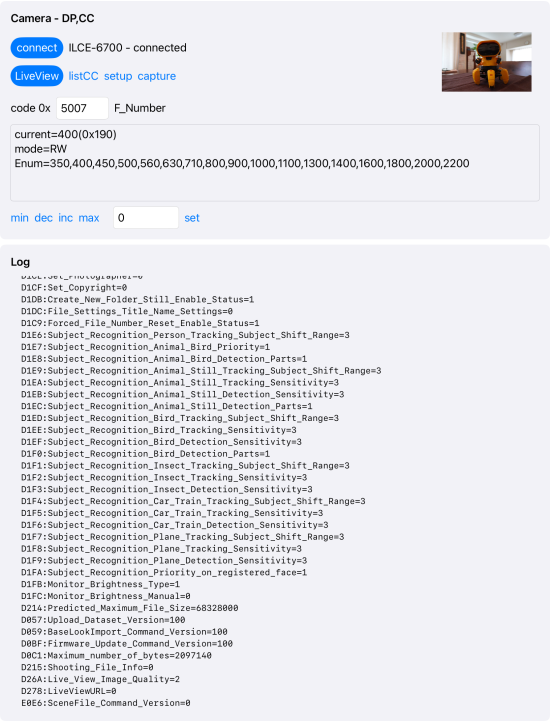
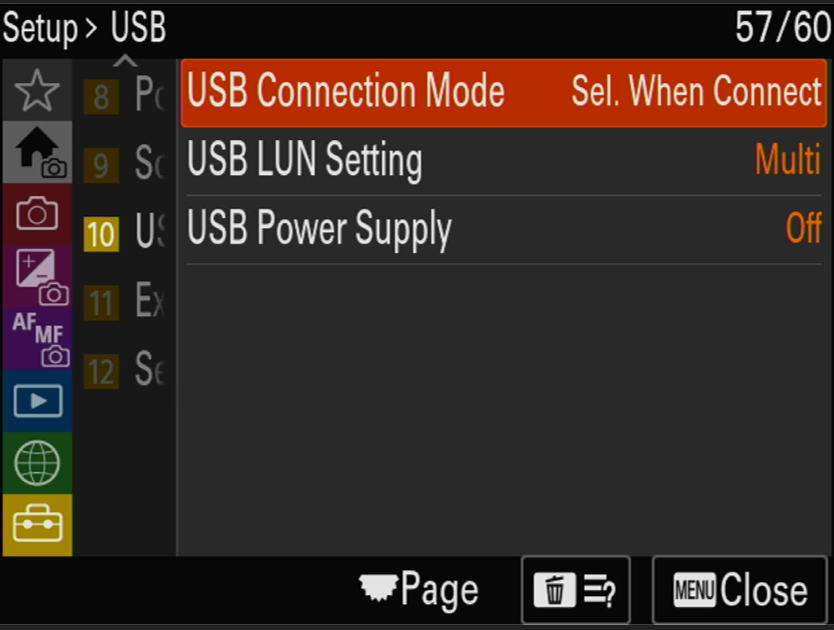
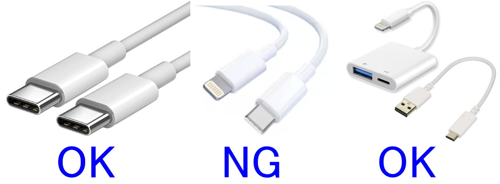
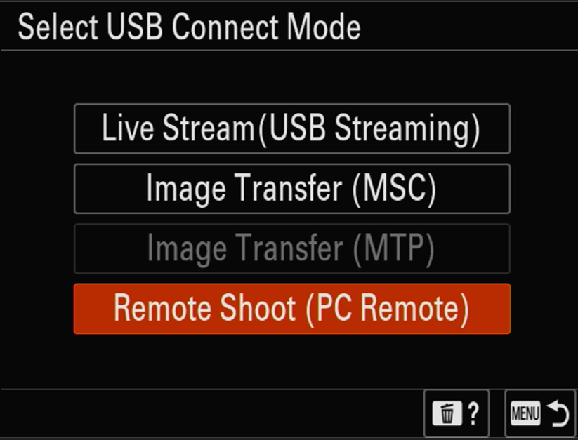

# CrCmd.DPCC.ios

A test tool for Sony cameras that lets you control your camera via USB.  
This is a test tool for Sony cameras that allows you to connect a camera to your smartphone via USB and control it.

.  
<a href=https://youtube.com/shorts/OTB9BZ0vInU>Link to play the demo video.</a>

## About This Tool

CrCommand (Camera Remote Command) is Sony's PTP protocol for alpha cameras.  
This app can be used as both a development tool and a sample implementation for apps built with CrCommand.

The source code for this app is available on GitHub. Please use it as a reference and try developing your own iOS/android camera app.

## Disclaimer

**Using this app to control a Sony camera may void the manufacturer's warranty.**

This app must not be used for critical applications such as life-support systems or for military purposes.  
These restrictions are based on the terms and conditions of Sony's library license agreement.  
SohtaMei and Sony shall not be liable for any damage, including camera malfunction or failure, caused by the use of this app.

- Sony license agreement: [https://support.d-imaging.sony.co.jp/app/cameraremotecommand/licenseagreement/index.html](https://support.d-imaging.sony.co.jp/app/cameraremotecommand/licenseagreement/index.html)

## System Requirements / Compatibility

- Host device: iPhone, iPad, Mac (Apple silicon / M series)
- This app supports CrCmd PTP-V3.
- Compatible cameras:
  - ILCE-1M2, ILCE-1, ILCE-9M3, ILCE-9M2
  - ILCE-7RM5, ILCE-7RM4A, ILCE-7RM4
  - ILCE-7M5, ILCE-7M4, ILCE-7SM3
  - ILCE-7CM2, ILCE-7CR, ILCE-7C
  - ILCE-6700, ILX-LR1
  - ILME-FX3(A), ILME-FX2, ILME-FX30
  - ZV-E1, ZV-E10M2, ZV-E10, ZV-1M2, ZV-1F, ZV-1(A)
  - DSC-RX1RM3, DSC-RX0M2, DSC-RX100M7(A)
- Not all cameras have been fully tested. Some models or features may not work as expected.
- Camera connections via WLAN or Bluetooth are not supported.

## download

app store [https://apps.apple.com/us/app/crcmd-dpcc/id6761293168](https://apps.apple.com/us/app/crcmd-dpcc/id6761293168)

## Setup

1. On the camera, set `[MENU] - [Setup] - [USB] - [USB Power Supply]` to `OFF`.
2. Set `[MENU] - [Setup] - [USB] - [USB Connection Mode]` to `Sel. When Connect` or `Remote Shooting`.

   

3. Connect your smartphone to the camera using a USB or Lightning cable.  
   If your smartphone uses a Lightning connector, a **Lightning to USB Camera Adapter** is required.

   

4. Select `PC Remote` mode on the camera.

   

## Privacy Policy

- This app does not collect users' personal information.

## Contact

- X: [https://x.com/sohta02](https://x.com/sohta02)
